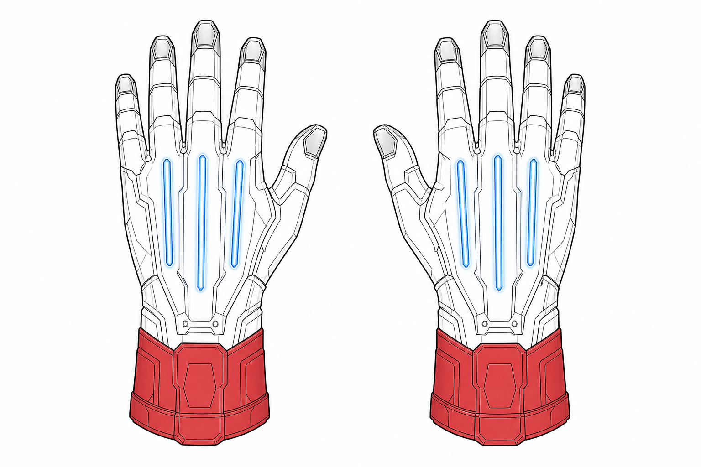

# Einar Dreadwolf — thunder-claws reference (tooling)

**Status:** Image-generation / modeler reference — **not** in-universe canon geometry lock unless *Armourium* files adopt it.

**Bearer:** **Einar Dreadwolf** — **The Lost** (*Amissi*); standard *Amissi* hand rig per [amissi-the-lost.md](../personae-command-index/doctrine-and-organs/amissi-the-lost.md).

## Layout (three layers)

1. **Thunder-claws (*ungues fulminis*)** — Noviomagus **compact** lightning claws. **Three** short power blades per hand on the **dorsal** (back-of-hand) housing. Blades **retract** flush against the wrist plate when disengaged. Same **Armourium** family as Shadows **thunder-claws** ([dossier-valens-ritter.md](../personae-command-index/character-dossiers/cohorts-and-detachments/dossier-valens-ritter.md)); *Amissi* issue is **open-hand assault**, not flush-hide stalker configuration.

2. **Free digits** — Palm and five fingers **fully articulated** (no power-fist bucket). Bolt trigger, ***Spina Cineris*** thumb access, and gauntlet maintenance remain possible without stripping the rig.

3. **Gaine digitale** — Elongated **adamantium fingertip sheaths** (couplers). Exanimus **keratin claws** seat inside the channel; **trimming waived** while the rig is worn. *Medicinae* performs **sheath clearance**, not nail amputation.

**Forearm in example:** Red vambrace shows *Amissi* **red limb** mark (arms + legs below knee on full suit).
