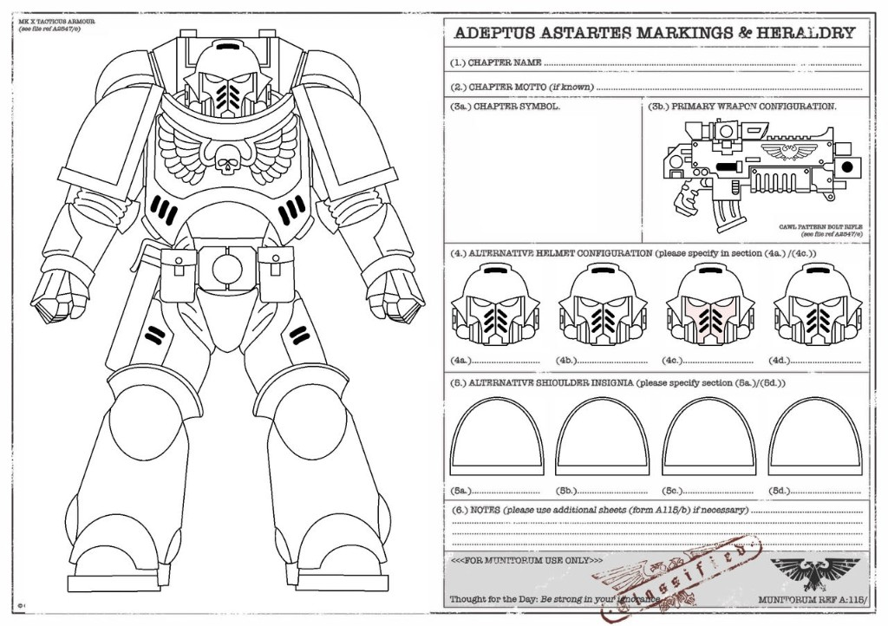

# Chapter organization — *Cohors Batavorum* (official register)

**Classification:** Official Chapter organization record.  
**Structure:** Mirrors the *Chapter Organization Template* section order (organizational worksheet; not a fill-in blank).  
**Terminology lock:** Combat grid = **Vexillatio** / **Vexillationes** only — the word **Company** is not used for Batavi units. Where the template names *Codex* companies, this register maps the same slots to **Vex. I–X**.  
**Authority:** Supersedes scattered summaries for organization; detail lives in linked doctrine files. Immutables: `.cursorrules`, [progenitor-classification.md](doctrine-and-organs/progenitor-classification.md).

**Related:** [military-hierarchy.md](doctrine-and-organs/military-hierarchy.md) · [vexillationes-and-visual-summary.md](../arsenal-and-logistics/vexillationes-and-visual-summary.md) · [visual-identity-paint-guide.md](../visual-identity-paint-guide.md) · [master-chronology.md](events-and-chronologies/master-chronology.md)

---

## Preface

### Description

This document is the canonical, organized lore register for the **Batavian Iron-Guard** (*Cohors Batavorum*): identity, culture, recruitment, doctrine, command grid, strategy, and departmental detail. It follows a standard fan-community chapter worksheet layout so remembrancers, players, and authors can find any field in one place.

### Formatting

Main sections use level-2 headings; subsections level-3; field labels **bold** with answers in prose or lists below. Cross-links point to deeper files rather than duplicating chronicle prose.

### Sources of inspiration

- [wh40k.lexicanum.com](https://wh40k.lexicanum.com) / Warhammer 40,000 wikis — Adeptus Astartes baseline.  
- *Index Astartes* — organizational vocabulary (mapped to Vexillationes here).  
- Warhammer Community — *Create Your Own Chapter* color sheet lineage (MUNITORUM markings layout).  
- **In-repo:** chronicles, dossiers, atlas, [mentality-and-philosophy.md](../lexicon-and-litanies/mentality-and-philosophy.md), political-relations folder.

---

## Chapter Information

### General

**Name:** **Cohors Batavorum** (formal); **Batavian Iron-Guard** (common Imperial rendering); civic myth frame **Der Batav** / *Der Batav’s Forge*.

**Successors of:** **Unknown / redacted** on open Administratum and tithe scrolls. Observers note **Russ-line–adjacent** Primaris phenotype with **non-standard second-strand variance**; **no** confirmed single progenitor Chapter on the public record. Sealed *Apothecarion* taxonomy: [progenitor-classification.md](doctrine-and-organs/progenitor-classification.md).

**Successor chapters:** **None registered.** The Chapter does not tithe gene-seed outward at a scale that would found named successors on open record.

**Founding:** **Unknown** (numbered Founding not disclosed). Operational rebirth and name ratification cluster in the **Castra Vetera (CV)** annals (**Foundation War** crucible → **Cohors Batavorum** council, *ca.* CV y29–y37); Imperial cross-filings are **approximate** (*Chronostrife*, mesh variance). See [foundation-war.md](events-and-chronologies/foundation-war.md), [master-chronology.md](events-and-chronologies/master-chronology.md).

**Reason of Founding:** Hold **Insula Tenebrarum** — the **Castra Vetera** island mesh — as **filter against the tide**: transform the **Aethelgard** crucible and **Nine Phalanx** into a permanent **wall** (xenos, Chaos bleed, renegade void) — not a parade founding, a **friction** founding.

**Niche:** **Friction Geometry** — static kill-math, trench and void-boarding mastery, *Analytical Silence*, chimeric biology regulated by ***Axioma Rationis***, super-tithe indispensability. The Chapter is a **wall instrument**, not a crusade flèche.

### Homeworld

**Name:** **Noviomagus Prime** (primary Chapter seat and forge heart); operational human and military frame = **Castra Vetera** subsector / **Nine Phalanx** (3×3 system mesh). See [general-atlas.md](../atlas-and-topography/general-atlas.md), [worlds-central-bastion.md](../atlas-and-topography/cultures/worlds-central-bastion.md).

**Status:** **Populated**, industrialized, under Chapter **stewardship** with Imperial civil stack intact. Sister seats (Castra-Vetera Prime, Khan-Bator Prime, Threshold worlds, etc.) **populated**; some theaters **corrupted** or **contested** by campaign, not abandoned as a block.

**Type:** **Civilized forge world** (Noviomagus); mixed **hive**, **agri-industrial**, **high-G**, **void-adjacent**, and **death-pressure** anchors across the mesh (per-system detail in atlas).

**Relation:** **Stewardship / direct military shadow** on Noviomagus Prime; **governor–Legatus** pairing per super-system for the nine frontier **Vexillationes**; recruitment and tithe touch multiple seats — not “distant chapter, one visit per generation.”

**Population:** Noviomagus Prime **~120 billion** (stacked hives); mesh aggregate in the **trillions** (civilis Imperialis).

**Location:** **Imperium Nihilus**, **Ultima Segmentum** — **Insula Tenebrarum** subsector (**Castra Vetera** polity); **Witness Ford** outward choke; **Forge / Tempest / Crown Marsh Channels** (triangle). Atlas: [`castra-vetera-galactic-lock.md`](../atlas-and-topography/castra-vetera-galactic-lock.md), [`general-atlas.md`](../atlas-and-topography/general-atlas.md).

**Description:** Noviomagus is throughput theology made planet: adamantium ribs, acid rain, forge cant, **gear-prayer** habit imported into Astartes friction culture. The Chapter does not rule as feudal kings; it **indexes** survival — tithe, route security, and biological quarantine of its own warriors inside the mesh ([pax-batavorum.md](doctrine-and-organs/pax-batavorum.md)).

### Fortress Monastery

**Name:** **Castra-Lupus** (wolf-fortress); command brain **Strategium** (Adamant Throne / silent-vigil era).

**Type:** **Planetary fortress complex** on Noviomagus Prime integrated with void yards; **not** a fleet-based wandering monastery. Strike elements embark from system docks (*Wrath of Noviomagus*, etc.).

**Location:** Noviomagus Prime — central bastion stack; sub-fortresses and relay forts across the **Nine Phalanx** (Legatus seats, Maleventum station, Bifrons gates, etc.).

**Description:** Industrial cathedral-warren: Strategium vaults, *Apothecarion* sealed wings, *Reclusiam* iron chapel, *Librarius* telemetry stacks, Martha’s kitchen as **sanctioned human anchor** (see chronicles). Unique chambers include **Hell Cells**, **Vermilion** filing, **Iron and Blood Tribunal** memorial site, Frontier Wolf plaque crypt. Chamber detail — § **Details → Chambers**.

### Characteristics

**Chapter Master:** **Alaric von Helis** — rank **Lord Castellan** (Batavi supreme field commander). Dossier: [dossier-alaric.md](character-dossiers/triumvirate/dossier-alaric.md).

**Motto:** **Unbent** (*incurvatus non sum* — Chapter short form).

**Warcry:** Open battle seal: **We hold.** (*Iron Protocol*.) Formal litany: *The Emperor dictates, we comply.* (*Faith Protocol.*)

**Size:** **5,000** battle-brothers with full gene-seed and Chapter status — **ten Vexillationes × 500**. Declared ***Codex Astartes* breach** (*Pax Batavorum*): friction-war replacement conveyor, not vanity expansion. Neophytes in pipeline, servitors, and auxilia **outside** the 5,000 ceiling. Table: [military-hierarchy.md](doctrine-and-organs/military-hierarchy.md) §4.

**Description:** The Chapter is a **Triumvirate-governed** war machine: **Alaric** (wall geometry), **Drusus** (biology), **Varro** (discipline / psychic risk). Nine **Legati** bear the ***Alabarda Vexillum*** on nine seats; **Vexillatio X (*Decima*)** is the Castellan’s anchor guard without a Legatus. **Siege Master / mesh architect:** **Gervas Bifronte** (Legatus, VI *Sexta*) — ***Maior Caementarius*** and ***Pater Murorum***; drafts capital fortresses with every Legatus while respecting each seat’s operational mode; supplies **Bifronte audit** weak-point slates to Alaric before major mesh commitments ([dossier-gervas-bifronte.md](character-dossiers/legati/dossier-gervas-bifronte.md)). Extended Council: **Kadmos** (*Armourium*), **Otho** (*Librarium*). Allies: Imperial Navy (Elara Solis), Mechanicus (conditional), Deathwatch (treaty), Inquisition (geometry of tolerance). Foes: traitor Astartes (Malakor register), Tyranids, Orks, genestealers, Necrons — theater-dependent.

---

## Colors of the Chapter

**Chapter symbol:** Roundel achievement — **crimson** field, **white** rectilinear frontal **wolf**, **orange** lens triangles (**105°** leg corner), **white** horizontal **gladius** + **black** contour, **black** double ring, **angular wave** band. Pauldron: **same wolf** (reduced), not a second icon. Rasters: [chapter-seal-official.png](../lore-images/chapter-seal-official.png). Law: [intro-and-heraldry.md](intro-and-heraldry/chapter-identity.md), [visual-identity-paint-guide.md](../visual-identity-paint-guide.md). **No lunar field.**

**Armor colors:** **Mechanicus Standard Grey** (~90% chassis); **Mephiston Red** pauldrons, forearms, oath-tracery; **Troll Slayer Orange** helm lenses (triangular read). Weathering: Noviomagus industrial haze.

**Helmet configuration:** Baseline Mk X — grey helm, orange lenses. Rank / role variants (working sheet — four slots):

| Slot | Role (register) | Treatment |
|------|-----------------|-----------|
| **4a** | Line battle-brother | Standard grey; orange lenses |
| **4b** | Sergeant | As line; squad geometry on relay / pauldron rim |
| **4c** | Veteran / Siege division | Gold rim cue on pauldron; helm may carry campaign marks |
| **4d** | Apothecary / Chaplain / specialist | *Medicinae* white-surgical (Drusus pattern); *Reclusiam* skull (Executor wolf-skull **Judex only**); *Librarius* cipher helm |
| **4e** | **Legatus** (I–IX) | **Per-seat** kit (e.g. *Typus Primus* **Corvus** + crest; *Typus Quintus* **Mk V** + wolf/pelt; *Typus Sextus* **Tartaros TDA** + ornate halo). **Default crest:** crimson / white transverse. **Chest aquila**. Orange lenses. Reference: ***Typus Primus — Ardens*** — [legati-operational-register.md](../arsenal-and-logistics/legati-operational-register.md) § Legatus armor |

**Shoulder insignia:** **Left:** **White** frontal-wolf on **crimson** field (or transfer). **Right:** Cohort color (Silence ivory, Shadows black, Stasis gunmetal, Nullity cobalt) + pure-line division rim (black / silver / gold). **Vexillatio** identity on ***Alabarda*** four-field panel (Roman **I–IX**), not a second shoulder chapter icon.

**Weapon colors:** **Noviomagus-pattern** bolt weapons — gunmetal, black furniture, minimal crimson pinstripe; chainswords and gladii — steel / ceramite, utilitarian. Cawl-pattern bolt rifle per Munitorum sheet below.

**Organizational markings:** **Vexillatio** numeral **I–IX** on Legatus ***Alabarda Vexillum*** (large Roman field). **Sub-cohort** captains command **100**; **lieutenants** **50**; **sergeants** **5–10** cells. No *Codex* company color trim. **Wolf’s Curse** clinical marks: **Furor** — horizontal crimson visor stripe; **Exanimus** — crimson gauntlets/forearms; **Hell Cell** penance — **vertical** helm stripe (distinct). Cohort and division tables: [vexillationes-and-visual-summary.md](../arsenal-and-logistics/vexillationes-and-visual-summary.md).

**Chapter decorations and honor markings:** Campaign kill-tallies on greaves; *Decima* justice iconography; **no** trophy skull theatre on line troops; restrained oath-script on knee plates. Legatus panels carry **success** or (*Prima* only) **obligation** fourth field — [vexilla-by-vexillatio-design.md](intro-and-heraldry/vexilla-by-vexillatio-design.md). Gilding rare — forge austerity.

**Symbolics meaning:** **Grey** = iron / civic burden / Noviomagus forge. **Crimson** = blood of the root (mortals the wall shields). **Orange lenses** = watchful machine predation regulated. **Wolf** = frontier predator mastered by geometry (not Fenris tribal god). **Horizontal gladius** = *second blade* / economical strike doctrine. **Waves** = amphibious myth and insertion that won the sector.

### Munitorum markings sheet (Primaris reference)

Official working layout for paint and insignia placement (fill completed art in editor; colors per [visual-identity-paint-guide.md](../visual-identity-paint-guide.md)):

*MUNITORUM REF A:115/ — paint-friendly Primaris template (FoxLGV); Chapter seal pasted in field (3a) when producing final art.*

---

## Chapter Culture

### Relation to humans

**General population:** **Pragmatic protection** with emotional austerity. Mortals are not worshipped; they are **load-bearing**. **Shared Sweat** ([pax-batavorum.md](doctrine-and-organs/pax-batavorum.md), [mentality-and-philosophy.md](../lexicon-and-litanies/mentality-and-philosophy.md)) — forge labor beside civilians **and** **war council** beside **Astra Militarum** command: same line of fire, plans contributed **alongside** generals, **without** breaking chain of command. Mass civilian death is **friction loss**, not spectacle; Martha’s kitchen is the sanctioned human warmth zone.

**Psykers:** **Controlled utility.** *Librarium* (**Haruspicium Batavorum**) is Chapter asset; Imperial psykers outside are **tools with paperwork**. Witch-hunt fanaticism is subordinated to ***Axioma Rationis***. Astropaths used as required; liaison discipline through [inquisition-geometry.md](../political-relations/inquisition-geometry.md).

**Abhumans:** **Case-by-case.** Imperium-legal abhumans may serve (e.g. **Valdric** — *Homo sapiens lupus* clinical asset on Aethelgard). Genestealer-adjacent or hybrid signatures = **kill geometry**, not prejudice theatre. Post–tithe chronicles document **abhuman slave liberation** under *Decima* oversight.

**Serfs:** Chapter serfs exist in forge and fortress stacks; treated as **indexed labor**, not family. Abuse without cause is **conduct fault** (Varro audit), not celebrated brutality.

**Serf culture:** Role-divided dormitories; reverence shown as **correct procedure** (stamp, queue, silence) more than feudal kneeling. Noviomagus “throughput theology” bleeds into serf idiom.

**Equerries:** **Not** a universal one-serf-per-Marine institution. Personal aides appear for senior officers and Triumvirate logistics; no Chapter-wide equerry codex.

### Relations with Imperial organizations

**Adeptus Mechanicus:** **Transactional alliance.** Techmarines trained on Mars pattern; Noviomagus forges co-produce frontier patterns. Friction over **unauthorized modifications**; cooperation when salvage and siege math benefit the mesh ([dossier-kadmos.md](character-dossiers/council-orders/dossier-kadmos.md)).

**Adeptus Astartes Chapters:** **Space Wolves** — reluctant allies; filing [`space-wolves-relations.md`](../political-relations/space-wolves-relations.md) (Garmr / Viggo **theater**: [`viggo-saga`](../chronicles/silent-vigil/viggo-the-heat-of-the-stone/viggo-saga/chapter.md)). Other Chapters: case-by-case; Deathwatch as structured bridge ([`deathwatch-and-batavorum.md`](../political-relations/deathwatch-and-batavorum.md)). No standing rivalry with Ultramarines-style *Codex* purists beyond bureaucratic suspicion of **5,000** strength.

**Astra Militarum:** **Geometry-first.** Regiments that hold a line receive calculated support; abandonment is **policy** when math demands — breeds hatred in some regiments, loyalty in others (tithe-of-sweetness register).

**Adeptus Astra Telepathica:** **Necessary infrastructure**; Astropaths aboard major hulls; Chapter does not outsource strategic memory to astropaths alone.

**Ecclesiarchy:** **Functional respect, theological distance.** Emperor honored as **Ancestor-Sovereign** / Throne-weight — **not** Ministorum-style god-worship. Chapter resists cathedral pageantry. Shared Sweat overlaps with worker faith without converting Marines to priestly fanaticism.

**Inquisition:** **High-friction symbiosis** — super-tithe buys tolerance; Ordo access negotiated; witness clauses; Malakor heresy purges documented. [inquisition-geometry.md](../political-relations/inquisition-geometry.md).

**Deathwatch:** **Mandatory certified *Watch cycle*** for Legatus track and *Decima* admission (post-051.M42); voluntary capped rotation otherwise. Default livery: Watch black + **Batavi pauldron**. [deathwatch-and-batavorum.md](../political-relations/deathwatch-and-batavorum.md).

**Rogue Traders:** **Selective.** Passage economics through Loken route; no dominant dynasty named in open register.

**Other:** **Adeptus Custodes** — Denial Protocol if ever present in kitchen prose *(no active chronicle; non-Batavi kitchen guests are **LEGACY** — [martha-kitchen-guest-astartes/INDEX.md](../../chronicles/outdated/martha-kitchen-guest-astartes/INDEX.md))*. **Adeptus Arbites** — legal architecture partner (e.g. Hive Vespera purge). **Imperial Navy** — Elara Solis / Outer Gate fleet geometry. **Adepta Sororitas** — no standing treaty file.

### Hated foes

**Chaos:** **Traitor Astartes** — First Legatus **Valerius** / **Malakor V** (050.M42) defines Chapter betrayal register; *Lupercal*-adjacent cadence without open Sons-of-Horus gene claim. **Daemons** — warp-tide incidents. **Cults** — Silence Cohort specialty.

**Xenos:** **Tyranids** (mesh approaches), **Orks** (Wild Hunt trigger biology), **Genestealers** (hive infiltration), **Necrons** (Threshold tombs), **T’au** minor border contact where narrated. Theater list expands per campaign — chronicles are authoritative for first contact horror.

**Other:** **Pirates / renegade governors** on tithe routes; **radical Inquisitors** as occasional political foes, not standing xenos category.

---

## Recruitment

**Location(s) of recruitment:** **Nine Phalanx** mortal pools — Noviomagus underhive and forge cadres, Aethelgard pressure zones, Incus-Gravis high-G settlements, Khan-Bator granary stacks, Threshold reef cultures, etc. No single “hunting planet” fiction.

**Aspirant selection and trials:** Extreme physical resilience and **endocrine stability** under pressure. Trials: atmospheric/G overload routes on **Aethelgard** and **Incus-Gravis**, continuous lethality stages, aggression burned through labor before ceramite. Personality: compliant to **Axiom**, not charismatic.

**Failed aspirant treatment:** Death in trial common; survivors who fail implant readiness → **serf track** or industrial labor — not heralded. Servitor conversion reserved for severe Chapter sentences, not routine failure.

**Gene-seed implementation rituals:** Standard Primaris implantation under *Apothecarion* with hypno-indoctrination; no public “drink the primarch’s blood” rite. Proximity-substrata witness inheritance during forge decade — [proximity-substrata-and-witness-inheritance.md](doctrine-and-organs/proximity-substrata-and-witness-inheritance.md).

**Further trials:** Neophytes serve as **scouts / heavy labor** in war zones; prove coordination under *Analytical Silence*. *Decima* candidates face additional **Batav Wolf trial** (containment dominance) — [military-hierarchy.md](doctrine-and-organs/military-hierarchy.md) §3.

**Role of Neophytes:** Scout-equivalent cells attached to Vexillatio operations; not a separate “Scout Vexillatio.” Labor in forges when not deployed.

**Process of becoming a Battle-Brother:** Black carapace completion → induction into **pure line** or cohort candidacy → power armor issue → sworn under *Faith Protocol* / *Axiom* registration. *Iron and Blood Tribunal* witness event for some cohorts (moral prep, not rank).

**Reaction to Primaris:** Chapter **is** Primaris-forward (Cawl-era architecture). Rubicon and mixed marks accepted under *Armourium* maintenance law. No “reject Primaris” faction in register.

---

## Doctrine

**Chapter philosophy:** ***Axioma Rationis*** — reason regulates emotion; duty without theatrical faith. ***Instrumentum Solum*** — “only a tool.” War as **friction mathematics**, not honor performance.

**Highest values:** Discipline, kill efficiency, logistical honesty, **hold geometry**, biological self-control, mortal continuity (tithe / Shared Sweat).

**Perception of the Emperor:** **Father-Emperor** and ultimate duty anchor — not Chapter-hyped god-king cult. *Faith Protocol* accepts Imperial cult language; inner register stays **compliance**.

**Views on death:** Marine death = **fulfilled friction** if gene-seed recovered; dishonor = discipline failure or uncontrolled **Versibar**. Mortal death = statistic unless witness debt imprints (Frontier Wolf plaques). Fallen brothers: crypts, [frontier-wolf-rite.md](doctrine-and-organs/frontier-wolf-rite.md), name chain on Castellan reliquary.

**Adherence to Codex Astartes:** **Non-compliant / divergent by promulgated policy.** Strength cap (**5,000**), **Vexillatio** grid, cohort structure, **Legatus** authority, ***Alabarda*** runtime law. Retains compatible elements: squad scale, specialist orders, Primaris equipment classes.

**Traditions:** *Analytical Silence* before assault; three-knuckle **gear prayer**; friction rites; *Remonstratio* pedagogy; gear-prayer on duty belt; no empty victory cheers.

**Character and behavior:** Stoic, clinically terse, predatory calm under stress; Furor-susceptible biology hidden behind masks. Veterans **respect** marked brothers; juniors **learn** from crimson stripes.

---

## Chapter organization

### Command structure

**General description:** **Lord Castellan** → **Triumvirate** (Alaric / Drusus / Varro) + **Extended Council** (Kadmos, Otho) → **Legatus** (500 each, Vex. I–IX) → **captain** (100 sub-cohort) → **lieutenant** (50) → **sergeant** (5–10). **Vexillatio X:** Triumvirate direct; **captain** Markus Graile as Castellan line face. **Curia Vexilli** per vex: Legatus + **Genetor Vexilli** + **Confessor Vexilli**. [military-hierarchy.md](doctrine-and-organs/military-hierarchy.md).

**Standard role advancement:** Not *Codex* devastator→assault→tactical rotation. Path: neophyte → **pure line** (Suppression / Ruin / Siege) and/or **cohort** (Silence / Shadows / Stasis / Nullity) → sergeant → lieutenant → captain → Legatus (with Watch gate) or *Decima* track.

**Climbing the ranks:** Documented kill ratio, *Axiom* audit cleanliness, logistics precision, **certified Watch cycle** (Legatus / *Decima*), cohort rotations, **Batav Wolf** (*Decima*), unanimous Triumvirate for supreme posts.

**Chapter Master’s role:** **Alaric** sets wall geometry, tithe policy, and sector treaty posture; biological anchor protocol (Viggo era → post-Viggo registry); holds **Execratio** history under Type III Duty harness.

**Captains’ roles:** **Sub-cohort captains** (100 brothers) execute planetary siege math under Legatus; bear iron-halo equivalents per *Armourium* issue; not independent Vexillatio commanders.

**Captains' specialist duties:**

*Batavi do not use Codex “Master of the …” titles per captain. Functions below map to **organ delegates**, **Legatus seats**, or **Strategium** posts.*

**Master of the Keep —** **Strategium** vault / Castra-Lupus integrity — **Tyvar** (Senior Strategium Overseer) + Castellan staff.

**Master of the Watch —** **Ivar Malevent** (VIII *Octava*) — reef, Maleventum station, Loken intercept; system watch geometry.

**Master of the Arsenal —** **Kadmos** (*Armourium*) — forges, pattern certification, vehicle pools.

**Master of the Fleet —** Shared: **Elara Solis** (mortal Outer Gate fleet) + Chapter void assets under *Strategium* / Legatus embarkation.

**Master of the Marches —** Rotating **Legatus** per deployed front; **Corbec Ardens** (*Prima*) for Noviomagus march when garrisoned.

**Master of the Rites —** **Varro** (*Reclusiam*); **Confessor Primus** audits vex confessors.

**Chief Victualler —** Khan-Bator / granary mesh — **Theron Brach** (*Tertia*) for caloric war; tithe logistics on Noviomagus.

**Lord Executioner —** **Varro** / Confessor lane — penance and execution rites; not a separate duelist post.

**Master of Relics —** *Armourium* reliquary under Kadmos; Legatus panels and seal registry.

**Master of Recruits —** Distributed *Apothecarion* + forge recruitment; no single named Master in register (**TBD** dossier).

**Master of Reconnaissance —** **Silence Cohort** doctrine + **Branimir Vorhalt** (*Quarta* *Decanus Primus*) for counter-infiltration standard.

**Lieutenants:** **Zone Mortalis** executors — half sub-cohort; translate Legatus geometry to corridor war; rare weapons per *Armourium* ticket.

**Sergeants:** **Squad calculators** — fire rhythm, cover, ammo; enforce harness bands per *Curia* clearance.

**Veterans:** **Siege division** gold-rim pure line; cohort seniors; instructor cadre from **Decima** on rotation.

**Command squads:** Legatus retinue around ***Alabarda*** — relay bearers, Confessor / Genetor aides, champion-grade duelists as needed; not *Codex* 10-man company command clone.

**Other:** **Genetor Primus**, **Confessor Primus** — Chapter-wide banner-court audit ([`disciplines-and-curia-vexilli-plan.md`](../planning/disciplines-and-curia-vexilli-plan.md)). **Steppenwolf** detached registry ([steppenwolf-doctrine.md](doctrine-and-organs/steppenwolf-doctrine.md)).

### Specialist ranks

**Prerequisites:** *Librarian* — born psyker, *Librarium* screening. *Techmarine* — technical aptitude, Mars training. *Chaplain* — stoic charisma, Varro selection. *Apothecary* — medical acuity, Drusus pipeline. *Champion* — melee supremacy. *Ancient* — steadfast bearer. *Honor guard* — *Decima* / Castellan retinue excellence.

**Librarian —** **Batavian Haruspices** — passive Warp radar, coded rites; active defense **Blindgate**. Chief: **Otho**. [dossier-otho.md](character-dossiers/council-orders/dossier-otho.md).

**Techmarine —** **4** per Vexillatio; Noviomagus rotation. Chief: **Kadmos**.

**Chaplain —** **Adjutant Chaplains** + **Confessor Vexilli**; **Varro** Judex. Executor wolf-skull **exclusive** to Varro unless ***licentia lupina***.

**Apothecary —** **4** + **Genetor Vexilli** per vex; Chief **Drusus**. Furor triage absolute.

**Champion —** Legatus-scale duelists; **Markus Graile** (Castellan captain) noted; no separate “Chapter Champion” parade post — see § Details.

**Ancient —** Vexillum / standard doctrine via ***Alabarda***; **Radulf LVI-1** (*The Old Wolf*) — Leviathan Dreadnought ancient.

**Honor guard —** **Vexillatio X (*Decima*)** — Castellan escort; five supreme posts embedded.

**Other —** **Genetor Vexilli**, **Confessor Vexilli**, **Liaison-Praefect** (Deathwatch — **Soren Riis**), **Senior Strategium Overseer** (**Tyvar**).

**Librarian:** (expanded) Force staves, psychic hoods, *Librarius* plate grey–crimson; battlefield role = telemetry + sanction, not battle-mage theatre.

**Techmarine:** Omnissian axe, servo-arms, forge catechism; maintain Noviomagus-pattern weapons.

**Chaplain:** Rosarius, crozius / maul; *Reclusiam* audits *Axiom* compliance.

**Apothecary:** Narthecium, reductor, diagnostor helm; gene-seed recovery mandatory.

**Champion:** Power sword / gladius geometry; bodyguard to Legatus or captain in void war.

**Ancient:** Bears vexillum charge; rally under *Analytical Silence* — banner as instrument, not morale cheer.

**Honor guard:** *Decima* five supremes + 279 line + cohorts; Terminator-capable Castellan guard moments.

**Other:** Iron Fathers **not used**; Triumvirate absorbs supreme spiritual/medical command.

### Force composition

**Organization description:** **Ten Vexillationes × 500** = **5,000**. Each Vexillatio = **4 cohorts × 50** + **pure line** + **16** organic specialists. **Vex. X** trades five pure-line slots for five supreme command posts.

**Unit types and roles:**

**Tactical Squad/Battleline Squad —** **Suppression Division** pure line — bolt/boltstorm dominance, anti-infantry geometry.

**Devastator Squad/Fire Support Squad —** **Ruin Division** — heavy anti-armor, missile/heavy bolt.

**Assault Squad/Close Support Squad —** **Armin Sturmwahl** *Quinta* culture — jump assault, chainsword-primary pure line exception; cohort Shadows vertical work.

**Terminator Squad —** Siege and Castellan crises; Gravis-certified VI *Sexta* bias.

**Veteran Squad —** Siege division gold-rim; *Decima* instructors.

**Scout Squad —** Neophyte cells in campaign; not a standalone Vexillatio.

**Company structure:**

*Template “Company” slots = **Vexillatio** assignments. No Codex 1st–10th company mapping.*

**1st Veteran Company —** **Vexillatio I (*Prima*)** — Noviomagus Prime; reference forge; **Legatus Corbec Ardens**; broken-cog obligation fourth field on *Alabarda*.

**2nd Battle Company —** **Vexillatio II (*Secunda*)** — Castra-Vetera Prime; **Legatus Henric Kessler**.

**3rd Battle Company —** **Vexillatio III (*Tertia*)** — Khan-Bator Prime; chem–thermal; **Legatus Theron Brach**.

**4th Battle Company —** **Vexillatio IV (*Quarta*)** — Incus-Gravis; high-G; **Legatus Orin Valestrand**.

**5th Battle Company —** **Vexillatio V (*Quinta*)** — Aethelgard Prime; storm assault; **Legatus Armin Sturmwahl**.

**6th Tactical Reserve Company —** **Vexillatio VI (*Sexta*)** — Bifrons-Ferrum; siege breach; **Legatus Gervas Bifronte** (Chapter **Siege Master**, ***Maior Caementarius*** / ***Pater Murorum***).

**7th Tactical Reserve Company —** **Vexillatio VII (*Septima*)** — Vitreus; plasma/photonic; **Legatus Lucan Phaetron**.

**8th Assault Reserve Company —** **Vexillatio VIII (*Octava*)** — Maleventum / reef; void war; **Legatus Ivar Malevent**.

**9th Devastator Reserve Company —** **Vexillatio IX (*Nona*)** — Marco de Vetra; relay/EM denial; **Legatus Cassian Vetra**.

**10th Scout Company/Vanguard Company —** **Vexillatio X (*Decima*)** — **anchor guard**; no Legatus; **justice vexillum** (wolf slain by sword); Triumvirate + **Markus Graile** (captain) + **Cael Dravic** (sergeant).

**Fleet description:** Chapter-operated **strike cruisers** and escorts — e.g. ***Wrath of Noviomagus*** (Viggo-era register), ***Gray Gargoyle***. Full hull count **not frozen** in open register; embarkation sized for **500** per major deployment. Naval macro-logistics often coordinated with **Elara Solis** Outer Gate fleet. System defense: **Maleventum** station (VIII), Noviomagus yards, Crucible ring assets.

---

## Strategy

**Way and size of deployment:** Default **Vexillatio** (500) or sub-cohort **100** / **50** slices for *Zone Mortalis*. Full mesh mobilization rare — **friction** prefers minimum sufficient mass. Drop pod / boarding / trench static defense per theater.

**Common formations:** **Testudo** siege walls; **Blade Wall** predatory line; boarding wedges with **Silence** forward; grav-locked ***Alabarda*** mast-plant on void decks (IX).

**Style of combat:** **Friction Geometry** — kill-zone overlap, trench mathematics, *Analytical Silence*, void static defense, counter-infiltration before purge. Rejects trophy charges and morale shouting.

**Favored weaponry:** **Noviomagus-pattern** bolt families; **power gladius** / chainsword (V *Quinta*); plasma (VII); void EM (IX); melta/breach (VI). Legatus ***Alabarda*** head type per vex: [alabarda-head-groups.md](../arsenal-and-logistics/alabarda-head-groups.md).

**Strengths:** Siege, void boarding, static defense, anti-infiltration, high-pressure environment operations, logistical throughput under tithe stress.

**Weaknesses:** **Biological ratchet** — warriors destabilize far from Noviomagus infrastructure; **Wild Hunt** / **Versibar** risk; political dependence on super-tithe; Imperial suspicion of strength and gene-line; slow strategic adaptation when Castellan enters Silent Vigil.

---

## Details

### Order of Battle

**999.M41:** **Not applicable** — pre–Foundation crucible filings destroyed or **redacted**; Chapter in current form post-dates usable Administratum snapshot.

**Current:** **Standard Order of Battle, ca. 570.M42** (frozen unless Triumvirate unanimous review):

| Aggregate | Count |
|-----------|------:|
| Cohorts (10 × 200) | 2,000 |
| Pure line (9×284 + 279) | 2,835 |
| Organic support (10 × 16) | 160 |
| Supreme command (*Decima* only) | 5 |
| **Total battle-brothers** | **5,000** |

Per-Vexillatio split: [military-hierarchy.md](doctrine-and-organs/military-hierarchy.md) §4.3 · [vexillationes-and-visual-summary.md](../arsenal-and-logistics/vexillationes-and-visual-summary.md) §1.1. **Legati roster:** [named-characters-register.md](named-characters-register.md).

### Chapter Command

**Chapter Master:** **Alaric von Helis** — see [dossier-alaric.md](character-dossiers/triumvirate/dossier-alaric.md). ***Castra-Lupus — Helis*** (Castellan artificer armor); ***Caput Ferreum Castellani***; *We hold*; protector geometry to Solis line. Office law: [castra-lupus-doctrine.md](../arsenal-and-logistics/castra-lupus-doctrine.md).

**Chapter Champion:** **No standalone Codex “Chapter Champion” post.** Duelist excellence filed under **Legatus/captain** champions and ***Decima*** retinue. Closest analog: **Markus Graile** (Castellan captain-instructor) / **Radulf LVI-1** (Leviathan ancient).

**Notable Characters:** [named-characters-register.md](named-characters-register.md) — Triumvirate, Legati I–IX, cohort anchors, Elara Solis, Martha line, expunged traitors **Valerius** / **Cassian Vorn**.

### Chambers

**Great Halls —** Strategium approach galleries; tithe presentation vaults; relay muster decks.

**Cells —** Spartan battle-brother cells; minimal personal property.

**Dormitories —** Serf and work-gang housing in lower forge stacks.

**Forges —** Noviomagus production spine; Bifrons twin forges; pattern certification bays.

**Librarius —** Otho’s telemetry stacks; sealed prognost archives; Blindgate training.

**Reclusiam —** Iron chapel; Varro’s litany vaults; Hell Cell access.

**Armory —** Kadmos vaults; pattern armories per Vexillatio embarkation.

**Apothecarion —** Drusus sealed labs; gene-seed crypts; Furor monitoring.

**Crypts —** Fallen brother ossuaries; Frontier Wolf plaque chain; reliquary for Viggo-era talismans.

### Political power

**Indispensability doctrine** — **15%** super-tithe, Loken Passage security, Inquisition geometry, Deathwatch utility. Chapter can prosecute heresy on-world via Inquisitorial gift (Malakor model). Weak when Administratum questions **5,000** or biology — [border-political-relations.md](../political-relations/border-political-relations.md), [pax-batavorum.md](doctrine-and-organs/pax-batavorum.md).

### Other

**Triumvirate unanimous** law for structural table changes. **No** captain voting conclave — geometry flows Legatus → Strategium. **Vexillatio** is the only tactical division term in official scrolls.

---

## Librarius

**Chief Librarian:** **Otho** — *Blood Augur*; [dossier-otho.md](character-dossiers/council-orders/dossier-otho.md).

**Chapter history:** Foundation crucible → *Cohors Batavorum* ratification → Malakor treason → Silent Vigil → post-Vigil purges. [master-chronology.md](events-and-chronologies/master-chronology.md).

**Legendary figures:** Alaric (living); Drusus/Varro; expunged **Valerius**; Tobias (mortal martyr); Viggo (anchor beast, deceased).

**Psychic Discipline:** **Haruspicium Batavorum** — passive detection, rite-coded algorithms; **Blindgate** active defense. Not Fenris rune-magic.

**Psychic Artifacts:** Force staves, third-eye clusters, prognost crystals — item list **TBD** in Armory annex.

**Secret Knowledge:** *Das Erbe* / chimeric architecture (sealed); Rift routing; traitor cadence signatures; DARK AGE relics in Kadmos salvage — compartmentalized.

**Other:** Wolf’s Curse interacts with psychic stress — Drusus veto absolute on unstable candidates.

---

## Reclusiam

**Master of Sanctity:** **Varro** (Master Chaplain / Judex) — appoints chaplains; [dossier-varro.md](character-dossiers/triumvirate/dossier-varro.md).

**Prayers:** *The Emperor dictates, we comply.* *We hold.* Litanies in [friction-rites.md](doctrine-and-organs/friction-rites.md).

**Rituals:** Friction rites; Frontier Wolf funeral; *Iron and Blood Tribunal* witness; Hell Cell; induction under *Axiom*.

**Oaths:** Mission oaths as **geometry contracts** — hold duration, gene-seed recovery, silence under vox.

**Penitence:** *Axiom* breach; wargear disrespect; uncontrolled Furor; **Hell Cell** vertical stripe record.

**Holy Relics:** Viggo talismans (regulated); Castellan reliquary; tribunal helm witness pieces.

**Other:** *anima speculum* soul-read — Varro exclusive high-risk tool.

---

## Armory

**Master of the Forge:** **Kadmos** — [dossier-kadmos.md](character-dossiers/council-orders/dossier-kadmos.md).

**Relic Wargear:** ***The Sentence*** (Alaric force gladius); Legatus ***Alabarda*** patterns; Dreadnought *The Old Wolf*.

**Chapter specific wargear:** ***Alabarda Vexillum*** relay haft; **Pillars of Noviomagus** traction boots; Noviomagus-pattern weapons — [weapons-and-equipment-catalog.md](../arsenal-and-logistics/weapons-and-equipment-catalog.md), [noviomagus-standard-engineering.md](../arsenal-and-logistics/noviomagus-standard-engineering.md).

**Servitors:** Forge and crypt labor; modified for hazardous foundries — counts **not** published.

**Equipment:** Auspex, vox, jump packs, grav-lock haft tools (IX), camouflage for Silence ops — [cohort-standard-kit.md](../arsenal-and-logistics/cohort-standard-kit.md).

**Weaponry:** Bolt, plasma, melta, flame where certified; cohort tables in cohort kit doc.

**Vehicles:** Gunships, Rhinos/Razorback analogs, siege tanks — pool **theater-scaled**; VI *Sexta* heaviest embarkation bias.

**Dreadnoughts:** **Leviathan** and standard patterns; **Radulf LVI-1**; interment when body fails but mind required — Varro/Drusus sign-off.

**Fleet:** See § **Fleet description**; in-depth hull roster **TBD** open register.

**Other:** Machine-spirit catechism by Kadmos; cybernetics common post-campaign.

---

## Apothecarion

**Chief Apothecary:** **Drusus** (Triumvirate) — [dossier-drusus.md](character-dossiers/triumvirate/dossier-drusus.md).

**Gene-seed stock:** Strategic reserves in sealed Noviomagus crypts; wartime drawdowns classified; recovery prioritized in all deployments.

**Gene-seed purity:** **Chimeric stabilised architecture** — medically certain dual expression (**Strand α / β** post–048.M42 sealed shorthand); **not** “stable Fenris stock.” Constant mutation watch.

**Gene-seed retrieval:** Standard **reductor** pipeline; apothecaries under fire; Versibar bodies **not** Watch-exportable.

**Organ characteristics:**

*Standard Nineteen where Primaris issue applies; expression filtered through **Wolf’s Curse** / chimeric predisposition. Clinical detail: [projection-aurea-wolfs-curse.md](../biological-encyclopedia-bestiary/projection-aurea-wolfs-curse.md).*

**Secondary heart —** Elevated stress coupling to Furor cascade.

**Ossmodula —** Noviomagus-density bone; high-G tolerance emphasis.

**Biscopea —** Standard; feeds enhanced musculature under siege load.

**Sinew Coils —** Supports *second blade* and trench leverage.

**Magnificat —** Standard Primaris scaling.

**Belisarian Furnace —** Standard.

**Haemastamen —** Furor-relevant; monitored hourly in combat theaters.

**Larraman’s Organ —** Standard seal function.

**Catalepsean Node —** Used for long static holds (*Analytical Silence* watches).

**Preomnor —** Standard.

**Omophagea —** Controlled; knowledge transfer subordinate to *Librarium* archives.

**Multi-lung —** Pressure and chem-war theaters (III *Tertia*).

**Occulobe —** Orange lens read; enhanced low-light in hive war.

**Lyman’s Ear —** *Analytical Silence* discipline support.

**Sus-an Membrane —** Standard.

**Melanochrome —** Standard.

**Oolitic kidney —** Standard toxin filter; chem-war peaks on Khan-Bator.

**Neuroglottis —** Standard.

**Mucranoid —** Standard.

**Betcher’s Gland —** Standard.

**Progenoid Glands —** Critical; harvest doctrine absolute.

**Black Carapace —** Battle-brother elevation gate.

**Organ implementation:**

**Phase 1 —** Aspirant screening and pressure trials (pre-implant).

**Phase 2 —** Initial gene-seed introduction + hypno-conditioning.

**Phase 3 —** Primary organ cluster implantation (apothecary clinic).

**Phase 4 —** Scout-equivalent field attachment.

**Phase 5 —** Mid-cycle organs + forge labor rotation.

**Phase 6 —** Combat theater neophyte proof.

**Phase 7 —** Black carapace integration.

**Phase 8 —** Power armor induction; *Axiom* swearing.

**Phase 9 —** Pure line or cohort assignment.

**Phase 10 —** Cohort certification (if applicable).

**Phase 11 —** Sub-cohort leadership candidacy.

**Phase 12 —** Deathwatch certification window (if Legatus/*Decima* track).

**Phase 13 —** Legatus / *Decima* selection review.

**Phase 14 —** Triumvirate supreme post (by appointment only).

**Phase 15 —** Continuous Furor monitoring for life.

*Exact organ-to-phase calendar matches standard Primaris Apothecary manuals with Batavi trial overlays — sealed in *Medicinae*.*

**Chemicals:** Furor sedatives; harness-band cocktails; Versibar containment (failed = capital or entombment); industrial toxin antidotes.

**Other:** ***Das Erbe*** (*Pendulum*) discovery **048.M42** — [projection-aurea-wolfs-curse.md](../biological-encyclopedia-bestiary/projection-aurea-wolfs-curse.md). No public donor manifest.

---

## Other

Official expansion for **specific Vexillationes**, chronicle prose, wargame lists, and figure galleries remains in linked dossiers and [chronicles/INDEX.md](../chronicles/INDEX.md). This file is the **organizational spine** only.

---

*Last updated: aligned to Vexillatio terminology lock and Munitorum template asset in `lore-images/`.*
