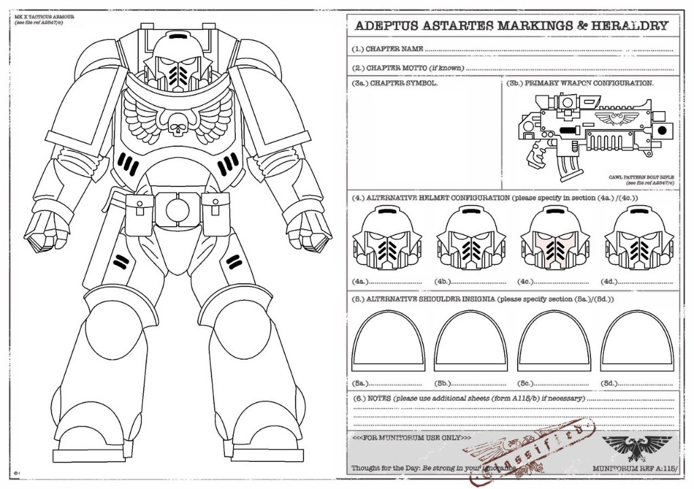

# Chapter organization — *Cohors Batavorum* (official register)

**Classification:** Official Chapter organization record.  
**Structure:** Mirrors the *Chapter Organization Template* section order (organizational worksheet; not a fill-in blank).  
**Terminology lock:** Seat / 500-cell block = **Vexilla** only (LATIN-CAPS **PRIMA–DECIMA**). **Company** names the captain’s **100** inside a Vexilla — not the Vexilla itself. Where the *Codex* template lists ten numbered companies as the Chapter’s top cut, this register maps those slots to **PRIMA–DECIMA**. Nested cut: [military-hierarchy.md](doctrine-and-organs/military-hierarchy.md) §3.4.  
**Authority:** Supersedes scattered summaries for organization; detail lives in linked doctrine files. Immutables: `.cursorrules`, [progenitor-classification.md](doctrine-and-organs/progenitor-classification.md).

**Related:** [military-hierarchy.md](doctrine-and-organs/military-hierarchy.md) · [vexilla-and-visual-summary.md](../arsenal-and-logistics/vexilla-and-visual-summary.md) · [visual-identity-paint-guide.md](../visual-identity-paint-guide.md) · [master-chronology.md](events-and-chronologies/master-chronology.md)

---

## Preface

### Description

This document is the canonical, organized lore register for the **Batavian Iron-Guard** (*Cohors Batavorum*): identity, culture, recruitment, doctrine, command grid, strategy, and departmental detail. It follows a standard fan-community chapter worksheet layout so remembrancers, players, and authors can find any field in one place.

### In a nutshell

**Space Marines with social anxiety and an identity crisis.**

They **adapt** to any biome, ally command style, and mesh culture — but **read wrong** at every joint briefing: no fixed Chapter template other Astartes can gossip about comfortably.

### Formatting

Main sections use level-2 headings; subsections level-3; field labels **bold** with answers in prose or lists below. Cross-links point to deeper files rather than duplicating chronicle prose.

### Sources of inspiration

- [wh40k.lexicanum.com](https://wh40k.lexicanum.com) / Warhammer 40,000 wikis — Adeptus Astartes baseline.  
- *Index Astartes* — organizational vocabulary (mapped to Vexilla here).  
- Warhammer Community — *Create Your Own Chapter* color sheet lineage (MUNITORUM markings layout).  
- **In-repo:** chronicles, dossiers, atlas, [mentality-and-philosophy.md](../lexicon-and-litanies/mentality-and-philosophy.md), political-relations folder.

---

## Chapter Information

### General

**Name:** **Cohors Batavorum** (formal); **Batavian Iron-Guard** (common Imperial rendering); civic myth frame **Der Batav** / *Der Batav’s Forge*.

**Successors of:** **Unknown / redacted** on open Administratum and tithe scrolls. Observers note **wolf-marked** or **legion-echo** chimeric Primaris traits with **non-standard second-imprint variance**; **no** confirmed single progenitor Chapter on the public record. Sealed *Apothecarion* taxonomy: [progenitor-classification.md](doctrine-and-organs/progenitor-classification.md). **Forbidden as fact:** Russ / Fenris progenitor stamp.

**Successor chapters:** **None registered.** The Chapter does not tithe gene-seed outward at a scale that would found named successors on open record.

**Founding:** **Unknown** (numbered Founding not disclosed). Operational rebirth: **the Reclamation** (**pre-Cadia**, year TBD). **Name:** given by the **people of Aethelgard** who saw them — *Der Batav* / **Cohors Batavorum** ([der-batav-myth.md](../lexicon-and-litanies/der-batav-myth.md)); **not** a Campaign III chronicle. Imperial cross-filings are **approximate**. See [the-reclamation.md](events-and-chronologies/the-reclamation.md), [master-chronology.md](events-and-chronologies/master-chronology.md).

**Reason of Founding:** Hold **Insula Tenebrarum** — the **Castra Vetera** island mesh — as **filter against the tide**: transform the **Aethelgard** crucible and **Nine Phalanx** into a permanent **wall** (xenos, Chaos bleed, renegade void) — not a parade founding, a **friction** founding.

**Niche:** **Friction Geometry** — static kill-math, trench and void-boarding mastery, *Analytical Silence*, chimeric biology regulated by ***Axioma Rationis***, super-tithe indispensability. The Chapter is a **wall instrument**, not a crusade flèche.

**Primary strategic objective:** **Do not get excommunicated** — avoid **Excommunicate Traitoris** and Chapter extinction. The Strategium pursues this through **many parallel lanes** (not one trick): super-tithe indispensability; **proactive** Inquisition joint operations and **Ordo infighting** so no bloc assembles unanimous excommunication; audit transparency (*Hell Cells*, *Vermilion*); mesh wall indispensability; *Limes Lupus* / Custodes collar; legal violence delivered for the Ordos when geometry demands; Deathwatch disclosure ledger for command-track gates — [inquisition-geometry.md](../political-relations/inquisition-geometry.md), [border-political-relations.md](../political-relations/border-political-relations.md). **Not** a goal: crusade brand, legible saga identity, or galactic conquest theater.

### Homeworld

**Name:** **Noviomagus Prime** (primary Chapter seat and forge heart); operational human and military frame = **Castra Vetera** subsector / **Nine Phalanx** (3×3 system mesh). See [general-atlas.md](../atlas-and-topography/general-atlas.md), [worlds-central-bastion.md](../atlas-and-topography/cultures/worlds-central-bastion.md).

**Status:** **Populated**, industrialized, under Chapter **stewardship** with Imperial civil stack intact. Sister seats (Castra-Vetera Prime, Khan-Bator Prime, Threshold worlds, etc.) **populated**; some theaters **corrupted** or **contested** by campaign, not abandoned as a block.

**Type:** **Civilized forge world** (Noviomagus); mixed **hive**, **agri-industrial**, **high-G**, **void-adjacent**, and **death-pressure** anchors across the mesh (per-system detail in atlas).

**Relation:** **Stewardship / direct military shadow** on Noviomagus Prime; **governor–Legatus** pairing per super-system for the nine frontier **Vexilla**; recruitment and tithe touch multiple seats — not “distant chapter, one visit per generation.”

**Population:** Noviomagus Prime **~120 billion** (stacked hives); mesh aggregate in the **trillions** (civilis Imperialis).

**Location:** **Imperium Nihilus**, **Ultima Segmentum** — **Insula Tenebrarum** subsector (**Castra Vetera** polity); **Witness Ford** outward choke; **Forge / Tempest / Crown Marsh Channels** (triangle). Atlas: [`castra-vetera-galactic-lock.md`](../atlas-and-topography/castra-vetera-galactic-lock.md), [`general-atlas.md`](../atlas-and-topography/general-atlas.md).

**Description:** Noviomagus is throughput theology made planet: adamantium ribs, acid rain, forge cant, **gear-prayer** habit imported into Astartes friction culture. The Chapter does not rule as feudal kings; it **indexes** survival — tithe, route security, and biological quarantine of its own warriors inside the mesh ([pax-batavorum.md](doctrine-and-organs/pax-batavorum.md)).

### Fortress Monastery

**Name:** **Castra-Lupus** (wolf-fortress precinct); command brain **Strategium** (Adamant Throne / silent-vigil era).

**Type:** **Planetary fortress precinct** on Noviomagus Prime — **three primary buildings** (not a single fused warren); integrated with void yards; **not** a fleet-based wandering monastery. Strike elements embark from system docks (*Wrath of Noviomagus*, etc.).

**Location:** Noviomagus Prime — central bastion precinct; sub-fortresses and relay forts across the **Nine Phalanx** (Legatus seats, Maleventum station, Bifrons gates, etc.).

**Triad (locked):**

| Building | Seat | Role |
|----------|------|------|
| **Strategium / Chapter Monastery** | Castellan | War-brain, living muster, council; *Librarius* / *Armourium* annex stacks; Martha’s kitchen as **sanctioned human anchor** |
| **Apothecarion** | Drusus | Gene-seed, autopsy, Furor / *Vermilion* |
| **Reclusiam** | Varro | Soul-law, Mortivigil HQ, Chapter-supreme bone vault |

Unique chambers include **Hell Cells**, **Vermilion** filing, **Iron and Blood Tribunal** memorial site, Frontier Wolf plaque crypt, **Chapter-supreme bone vault**, and PRIMA capital crypt (Noviomagus — distinct from the supreme vault). Death geometry: [mortivigil-and-reclusiam-helm-law.md](doctrine-and-organs/mortivigil-and-reclusiam-helm-law.md). Chamber detail — § **Details → Chambers**.

### Characteristics

**Chapter Master:** **Alaric von Helis** — rank **Lord Castellan** (Batavi supreme field commander). Dossier: [dossier-alaric.md](character-dossiers/triumvirate/dossier-alaric.md).

**Motto:** **Unbent** (*incurvatus non sum* — Chapter short form).

**Warcry:** Open battle seal: **We hold.** (*Iron Protocol*.) Formal litany: *The Emperor dictates, we comply.* (*Faith Protocol.*)

**Size:** **5,000** battle-brothers with full gene-seed and Chapter status — **ten Vexilla × 500**. Declared ***Codex Astartes* breach** (*Pax Batavorum*): friction-war replacement conveyor, not vanity expansion. Neophytes in pipeline, servitors, and auxilia **outside** the 5,000 ceiling. Table: [military-hierarchy.md](doctrine-and-organs/military-hierarchy.md) §4.

**Description:** The Chapter is a **Triumvirate-governed** war machine: **Alaric** (wall geometry), **Drusus** (biology), **Varro** (discipline / psychic risk). Nine **Legati** bear the ***Alabarda* + Vexilla** on nine seats; **Vexilla DECIMA** is the Castellan’s anchor guard without a Legatus. **Siege Master / mesh architect:** **Gervas Bifronte** (Legatus, SEXTA) — ***Maior Caementarius*** and ***Pater Murorum***; drafts capital fortresses with every Legatus while respecting each seat’s operational mode; supplies **Bifronte audit** weak-point slates to Alaric before major mesh commitments ([dossier-gervas-bifronte.md](character-dossiers/legati/dossier-gervas-bifronte.md)). Extended Council: **Kadmos** (*Armourium*), **Otho** (*Librarium*). Allies: Imperial Navy (Elara Solis), Mechanicus (conditional), Inquisition (purchased symbiosis). **Primary Astartes enemy:** **Marines Malevolent** (standing open-fire policy — [marines-malevolent-relations.md](../political-relations/marines-malevolent-relations.md)). Other foes: traitor Astartes (Malakor register), Tyranids, Orks, genestealers, Necrons — theater-dependent.

---

## Colors of the Chapter

**Chapter symbol:** Roundel achievement — **crimson** field, **white** rectilinear frontal **wolf**, **orange** lens triangles (**105°** leg corner), **white** horizontal **gladius** + **black** contour, **black** double ring, **angular wave** band. Pauldron: **same wolf** (reduced), not a second icon. Rasters: [chapter-seal-official.png](../lore-images/chapter-seal-official.png). Law: [intro-and-heraldry.md](intro-and-heraldry/chapter-identity.md), [visual-identity-paint-guide.md](../visual-identity-paint-guide.md). **No lunar field.**

**Armor colors:** **Mechanicus Standard Grey** (~90% chassis); **Mephiston Red** pauldrons, forearms, oath-tracery; **Troll Slayer Orange** helm lenses (triangular read). Weathering: Noviomagus industrial haze.

**Helmet configuration:** Baseline Mk X — grey helm, orange lenses. Rank / role variants (working sheet — four slots):

| Slot | Role (register) | Treatment |
|------|-----------------|-----------|
| **4a** | Line battle-brother | Standard grey; orange lenses |
| **4b** | Sergeant | As line; squad geometry on relay / pauldron rim |
| **4c** | Veteran / Siege division | Gold rim cue on pauldron; helm may carry campaign marks |
| **4d** | Apothecary / Chaplain / specialist | *Medicinae* white-surgical (Drusus pattern); *Reclusiam*: Chaplain Executor wolf-skull (red lenses) / Varro fire-orb Judex extras + thurible pack / Mortivigil human death-skull (orange) / **Judiciar** sealed death-skull (extinguished lenses); *Librarius* cipher helm |
| **4e** | **Legatus** (PRIMA–NONA) | **Per-seat** kit (e.g. *Typus Primus* **Corvus** + crest; *Typus Quintus* **Mk V** + wolf/pelt; *Typus Sextus* **Tartaros TDA** + ornate halo). **Default crest:** crimson / white transverse. **Chest aquila**. Orange lenses. Reference: ***Typus Primus — Ardens*** — [legati-operational-register.md](../arsenal-and-logistics/legati-operational-register.md) § Legatus armor |

**Shoulder insignia:** **Left:** **White** frontal-wolf on **crimson** field (or transfer). **Right:** Cohort color (Silence ivory, Shadows black, Stasis gunmetal, Nullity cobalt) + pure-line division rim (black / silver / gold). **Vexilla** identity on ***Alabarda*** four-field panel (LATIN-CAPS **PRIMA–NONA**), not a second shoulder chapter icon.

**Weapon colors:** **Noviomagus-pattern** bolt weapons — gunmetal, black furniture, minimal crimson pinstripe; chainswords and gladii — steel / ceramite, utilitarian. Cawl-pattern bolt rifle per Munitorum sheet below.

**Organizational markings:** **Vexilla** seat name (**PRIMA–NONA**) on Legatus ***Alabarda* + Vexilla** (LATIN-CAPS field). **Company** captains command **100**; **demi-company** lieutenants **50**; **squad** sergeants **5–10**. No *Codex* company color trim on the 500. **Wolf’s Curse** clinical marks: **Furor** — horizontal crimson visor stripe; **Exanimus** — crimson gauntlets/forearms; **Hell Cell** penance — **vertical** helm stripe (distinct). Cohort and division tables: [vexilla-and-visual-summary.md](../arsenal-and-logistics/vexilla-and-visual-summary.md).

**Chapter decorations and honor markings:** Campaign kill-tallies on greaves; DECIMA justice iconography; **no** trophy skull theatre on line troops; restrained oath-script on knee plates. Legatus panels carry **success** or (PRIMA only) **obligation** fourth field — [vexilla-by-vexilla-design.md](intro-and-heraldry/vexilla-by-vexilla-design.md). Gilding rare — forge austerity.

**Symbolics meaning:** **Grey** = iron / civic burden / Noviomagus forge. **Crimson** = blood of the root (mortals the wall shields). **Orange lenses** = watchful machine predation regulated. **Wolf** = frontier predator mastered by geometry (not Fenris tribal god). **Horizontal gladius** = *second blade* / economical strike doctrine. **Waves** = amphibious myth and insertion that won the sector.

### Munitorum markings sheet (Primaris reference)

Official working layout for paint and insignia placement (fill completed art in editor; colors per [visual-identity-paint-guide.md](../visual-identity-paint-guide.md)):

*MUNITORUM REF A:115/ — paint-friendly Primaris template (FoxLGV); Chapter seal pasted in field (3a) when producing final art.*

---

## Chapter Culture

### Identity and read (homebrew register)

**Trope embraced:** **Super-adaptability** — any biome, allied command style, and mesh culture; chimeric biology mirrors “fits whatever slot the wall needs.”

**Subversion:** **Uncanny unorthodoxy** — **5,000** mesh filing, open *Hell Cell* audits, permanent helms, witness clauses, archipelago quarantine: allied Chapters win beside them, then leave with **wrong aftertaste**. Social register: **social anxiety** and **identity crisis** — function everywhere; **legible personality nowhere**.

### Relation to humans

**General population:** **Pragmatic protection** with emotional austerity. Mortals are not worshipped; they are **load-bearing**. **Shared Sweat** ([pax-batavorum.md](doctrine-and-organs/pax-batavorum.md), [mentality-and-philosophy.md](../lexicon-and-litanies/mentality-and-philosophy.md)) — forge labor beside civilians **and** **war council** beside **Astra Militarum** command: same line of fire, plans contributed **alongside** generals, **without** breaking chain of command. Mass civilian death is **friction loss**, not spectacle; Martha’s kitchen is the sanctioned human warmth zone.

**Psykers:** **Controlled utility.** *Librarium* (**Haruspicium Batavorum**) is Chapter asset; Imperial psykers outside are **tools with paperwork**. Witch-hunt fanaticism is subordinated to ***Axioma Rationis***. Astropaths used as required; liaison discipline through [inquisition-geometry.md](../political-relations/inquisition-geometry.md).

**Abhumans:** **Case-by-case.** Imperium-legal abhumans may serve (e.g. **Valdric** — *Homo sapiens lupus* clinical asset on Aethelgard). Genestealer-adjacent or hybrid signatures = **kill geometry**, not prejudice theatre. Post–tithe chronicles document **abhuman slave liberation** under DECIMA oversight.

**Serfs:** Chapter serfs exist in forge and fortress stacks; treated as **indexed labor**, not family. Abuse without cause is **conduct fault** (Varro audit), not celebrated brutality.

**Serf culture:** Role-divided dormitories; reverence shown as **correct procedure** (stamp, queue, silence) more than feudal kneeling. Noviomagus “throughput theology” bleeds into serf idiom.

**Equerries:** **Not** a universal one-serf-per-Marine institution. Personal aides appear for senior officers and Triumvirate logistics; no Chapter-wide equerry codex.

### Relations with Imperial organizations

**Adeptus Mechanicus:** **Transactional alliance.** Techmarines trained on Mars pattern; Noviomagus forges co-produce frontier patterns. Friction over **unauthorized modifications**; cooperation when salvage and siege math benefit the mesh ([dossier-kadmos.md](character-dossiers/council-orders/dossier-kadmos.md)).

**Adeptus Astartes Chapters:** **Marines Malevolent** — **primary Astartes enemy**; **only** Chapter on **standing open-fire policy** under Castra Vetera mandate (Vigilax register, 110.M42) — [marines-malevolent-relations.md](../political-relations/marines-malevolent-relations.md). **Secondary friction only** (not shoot-on-sight): **Space Wolves** — irrational, filthy-animal register; reluctant joint axes — [`space-wolves-relations.md`](../political-relations/space-wolves-relations.md) (Garmr / Viggo **theater**: [`viggo-saga`](../chronicles/silent-vigil/viggo-the-heat-of-the-stone/viggo-saga/chapter.md)); **Dark Angels** — paranoid, self-ashamed inner-circle culture; ***Codex* purists** — bureaucratic suspicion of **5,000** strength. Other Chapters: case-by-case joint ops. **Deathwatch is not filed here** — multi-origin Ordo Xenos instrument; see § Deathwatch below.

**Astra Militarum:** **Geometry-first.** Regiments that hold a line receive calculated support; abandonment is **policy** when math demands — breeds hatred in some regiments, loyalty in others (tithe-of-sweetness register). **Fragile ally** register: regiments burned by abandonment math.

**Adeptus Astra Telepathica:** **Necessary infrastructure**; Astropaths aboard major hulls; Chapter does not outsource strategic memory to astropaths alone.

**Ecclesiarchy:** **Functional respect, theological distance.** Emperor honored as **Ancestor-Sovereign** / Throne-weight — **not** Ministorum-style god-worship. Chapter resists cathedral pageantry. Shared Sweat overlaps with worker faith without converting Marines to priestly fanaticism.

**Inquisition:** **Purchased symbiosis** — the Chapter **requests** joint operations (legal purges, anomaly cages, frontier intelligence) rather than waiting passively for audit; **witness clause** builds loyalty paper trail; **Ordo infighting** (Hereticus / Xenos / Chronos agendas) exploited so no faction assembles unanimous **Excommunicate Traitoris** push; super-tithe and *Limes Lupus* buy baseline tolerance. **Cost:** Inquisitors in the mesh; audit exposure; Varro humiliation protocol when an Inquisitor performs ego, not truth. [inquisition-geometry.md](../political-relations/inquisition-geometry.md).

**Deathwatch:** **Not an Adeptus Astartes Chapter relation** — Ordo Xenos **kill-team creditor** (multi-origin rotations). **Mandatory certified *Watch cycle*** for Legatus track and DECIMA admission (post-051.M42); voluntary capped rotation otherwise. Default livery on loan: Watch black + **Batavi pauldron**. Career / *Medicinae* gate only — [deathwatch-and-batavorum.md](../political-relations/deathwatch-and-batavorum.md).

**Rogue Traders:** **Selective.** Passage economics through Loken route; no dominant dynasty named in open register.

**Other:** **Adeptus Custodes** — Denial Protocol if ever present in kitchen prose *(no active chronicle; non-Batavi kitchen guests are **LEGACY** — [martha-kitchen-guest-astartes/INDEX.md](../../chronicles/outdated/martha-kitchen-guest-astartes/INDEX.md))*. **Adeptus Arbites** — legal architecture partner (e.g. Hive Vespera purge). **Imperial Navy** — Elara Solis / Outer Gate fleet geometry. **Adepta Sororitas** — no standing treaty file.

### Hated foes

**Loyalist Adeptus Astartes:** **Marines Malevolent** — **primary Astartes enemy**; **only** Chapter Batavi will **open fire** on under Castra Vetera mandate without awaiting higher sanction — unauthorized purge, collateral-as-lesson doctrine, antithesis of Shared Sweat. Vigilax origin (110.M42): [vigilax-incident/chapter.md](../chronicles/vigilax/vigilax-incident/chapter.md); policy: [marines-malevolent-relations.md](../political-relations/marines-malevolent-relations.md). **All other loyalist Chapters:** secondary friction — not standing shoot-on-sight.

**Chaos:** **Traitor Astartes** — First Legatus **Valerius** / **Malakor V** (050.M42) defines Chapter betrayal register; *Lupercal*-adjacent cadence without open Sons-of-Horus gene claim. **Daemons** — warp-tide incidents. **Cults** — Silence Cohort specialty.

**Xenos:** **Tyranids** (mesh approaches), **Orks** (Wild Hunt trigger biology), **Genestealers** (hive infiltration), **Necrons** (Threshold tombs), **T’au** minor border contact where narrated. Theater list expands per campaign — chronicles are authoritative for first contact horror.

**Other:** **Pirates / renegade governors** on tithe routes; **radical Inquisitors** as occasional political foes, not standing xenos category.

---

## Recruitment

**Location(s) of recruitment:** **Nine Phalanx** mortal pools — Noviomagus underhive and forge cadres, Aethelgard pressure zones, Incus-Gravis high-G settlements, Khan-Bator granary stacks, Threshold reef cultures, etc. No single “hunting planet” fiction.

**Aspirant selection and trials:** Extreme physical resilience and **endocrine stability** under pressure. Trials: atmospheric/G overload routes on **Aethelgard** and **Incus-Gravis**, continuous lethality stages, aggression burned through labor before ceramite. Personality: compliant to **Axiom**, not charismatic.

**Failed aspirant treatment:** Death in trial common; survivors who fail implant readiness → **serf track** or industrial labor — not heralded. Servitor conversion reserved for severe Chapter sentences, not routine failure.

**Gene-seed implementation rituals:** After Primaris **method** seal (~**051.M42**), **new** brothers receive standard Primaris implantation under *Apothecarion* with hypno-indoctrination; no public “drink the primarch’s blood” rite. Pre-method line was **Firstborn**; eligible survivors **crossed the Rubicon** first. Unraised outsiders grown from this seed are **not** Batavi until the den claims them — [wolfs-curse-origin-and-den.md](doctrine-and-organs/wolfs-curse-origin-and-den.md) · [primaris-rubicon-intake.md](doctrine-and-organs/primaris-rubicon-intake.md). Proximity-substrata witness inheritance during forge decade — [proximity-substrata-and-witness-inheritance.md](doctrine-and-organs/proximity-substrata-and-witness-inheritance.md).

**Further trials:** Neophytes serve as **scouts / heavy labor** in war zones; prove coordination under *Analytical Silence*. DECIMA candidates face additional **Batav Wolf trial** (containment dominance) — [military-hierarchy.md](doctrine-and-organs/military-hierarchy.md) §3.

**Ascent office:** **Custos Ascensum** is the **college of nine Procurators** (PRIMA–NONA). **Speaker** elected from any seat, rotates, keeps his home Procurator hat. **Genetor Primus** co-signs biology. Neophyte **full** circuit (eight any order, **PRIMA last**); young brothers **short** stamp-tour. **Wolfkeeper liaison** each cycle for *Axiom* / induction — [custos-ascensum-doctrine.md](doctrine-and-organs/custos-ascensum-doctrine.md). Speaker this rotation **unnamed**.

**Role of Neophytes:** Scout-equivalent cells attached to Vexilla operations; not a separate “Scout Vexilla.” Labor in forges when not deployed. **Circuit:** full study at eight seats (any order), **PRIMA last** — [custos-ascensum-doctrine.md](doctrine-and-organs/custos-ascensum-doctrine.md) §V.

**Process of becoming a Battle-Brother:** Black carapace completion → induction into **pure line** or cohort candidacy → power armor issue → sworn under *Faith Protocol* / *Axiom* registration. *Iron and Blood Tribunal* witness event for some cohorts (moral prep, not rank).

**Reaction to Primaris:** **Method, not a shipment of sons.** Eligible Firstborn crossed the Rubicon; **thereafter all new marines are Primaris**, made and raised in Castra. No “reject Primaris” faction. Mixed marks under *Armourium* maintenance law. Foreign battle-brother tranches are **forbidden** by den-law. [primaris-rubicon-intake.md](doctrine-and-organs/primaris-rubicon-intake.md).

---

## Doctrine

**Chapter philosophy:** ***Axioma Rationis*** — reason regulates emotion; duty without theatrical faith. ***Instrumentum Solum*** — “only a tool.” War as **friction mathematics**, not honor performance.

**Strategic objective:** **Do not get excommunicated** — see § Chapter Information → **Primary strategic objective** (multi-lane survival filing).

**Highest values:** Discipline, kill efficiency, logistical honesty, **hold geometry**, biological self-control, mortal continuity (tithe / Shared Sweat).

**Perception of the Emperor:** **Father-Emperor** and ultimate duty anchor — not Chapter-hyped god-king cult. *Faith Protocol* accepts Imperial cult language; inner register stays **compliance**.

**Views on death:** Marine death = **fulfilled friction** if gene-seed recovered; dishonor = discipline failure or uncontrolled **Versibar**. Mortal death = statistic unless witness debt imprints (Frontier Wolf plaques). Fallen brothers: funeral pyre → Wall-name (where he held) → bones to home crypt — [mortivigil-and-reclusiam-helm-law.md](doctrine-and-organs/mortivigil-and-reclusiam-helm-law.md); Frontier Wolf plaques [frontier-wolf-rite.md](doctrine-and-organs/frontier-wolf-rite.md). **Greatest offenses:** **treason** and **desecration of Batavi dead** (other dead are respected, not sacred).

**Adherence to Codex Astartes:** **Non-compliant / divergent by promulgated policy.** Strength cap (**5,000**), **Vexilla** grid, cohort structure, **Legatus** authority, ***Alabarda*** runtime law. Retains compatible elements: squad scale, specialist orders, Primaris equipment classes.

**Traditions:** *Analytical Silence* before assault; three-knuckle **gear prayer**; friction rites; *Remonstratio* pedagogy; gear-prayer on duty belt; no empty victory cheers.

**Character and behavior:** Stoic, clinically terse, predatory calm under stress; Furor-susceptible biology hidden behind masks. Veterans **respect** marked brothers; juniors **learn** from crimson stripes.

---

## Chapter organization

### Command structure

**General description:** **Lord Castellan** → **Triumvirate** (Alaric / Drusus / Varro) + **Extended Council** (Kadmos, Otho) → **Legatus** (**Vexilla**, 500 each, PRIMA–NONA) → **captain** (**company**, 100) → **lieutenant** (**demi-company**, 50) → **sergeant** (**squad**, 5–10). **DECIMA:** **LVPVS IMPERATORIS** (**Emperor’s Wolf**) commands the **DECIMA** battle grid on Castellan orders (**Castellan → Emperor’s Wolf → execution**); five supreme posts (Alaric, Drusus, Varro, Kadmos, Otho) retain organ lanes. **Curia Vexilli** per vex: Legatus + **Genetor Vexilli** + **Confessor Vexilli**. Grid names: [military-hierarchy.md](doctrine-and-organs/military-hierarchy.md) §3.4.

**Standard role advancement:** Not *Codex* devastator→assault→tactical rotation. Path: neophyte → **pure line** (Suppression / Ruin / Siege) and/or **cohort** (Silence / Shadows / Stasis / Nullity) → sergeant → lieutenant → captain → Legatus (with Watch gate) or **DECIMA** track → **LVPVS IMPERATORIS** (Emperor’s Wolf) by Triumvirate appointment from DECIMA excellence lattice.

**Climbing the ranks:** Documented kill ratio, *Axiom* audit cleanliness, logistics precision, **certified Watch cycle** (Legatus / DECIMA), cohort rotations, **Batav Wolf** (DECIMA), unanimous Triumvirate for supreme posts.

**Chapter Master’s role:** **Alaric** sets wall geometry, tithe policy, and sector treaty posture; biological anchor protocol (Viggo era → post-Viggo registry); holds **Execratio** history under Type III Duty harness.

**Captains’ roles:** **1st–5th company** captains (~**five** per Vexilla; **100** brothers) execute planetary siege math under the Legatus. **Fixed mix:** 1st Silence+line, 2nd Shadows+line, 3rd Stasis+line, 4th Nullity+line, 5th line+line (two rims). Line half **biased** by seat; support **sprinkled**. Full table: [military-hierarchy.md](doctrine-and-organs/military-hierarchy.md) §3.4. Bear iron-halo equivalents per *Armourium* issue; not independent Vexilla commanders. Spoken: *captain of the third company, QVINTA* — seat stays LATIN-CAPS.

**Captains' specialist duties:**

*Batavi assign **one Chapter mastery scroll** per **Legatus** (classic or invented). **Company** captains (~five per Vexilla) execute theater math under the Legatus — **not** *Codex* “Master of the …” per captain. Full map: [`legatus-chapter-mastery.md`](doctrine-and-organs/legatus-chapter-mastery.md).*

| *Codex* / office | **Holder** |
| ---------------- | ---------- |
| **I · Master of the Keep** | **Legatus PRIMA** · Corbec Ardens |
| **II · Master of the Watch** | **Legatus NONA** · Cassian Vetra |
| **III · Master of the Arsenal** | **Kadmos** (Master of the Forge) |
| **IV · Master of the Fleet** | **Legatus OCTAVA** · Ivar Malevent |
| **V · Master of the Marches** | **Lord Castellan** · Alaric (**ex officio** — no second hat) |
| **VI · Master of the Rites** | **Varro** (Judex) |
| **VII · Chief Victualler** | **—** (no Astartes counterpart) |
| **VIII · Lord Executioner** | **Graile** · **LVPVS IMPERATORIS** |
| **IX · Master of the Relics** | **Kadmos** (with Arsenal) |
| **X · Master of the Ascent** | **Custos Ascensum** (college of nine Procurators; rotating Speaker) |
| **Master of the Law** *(invented)* | **Legatus SECVNDA** · Henric Kessler |
| **Master of the Breach** | **Legatus TERTIA** · Theron Brach |
| **Master of the Anchor** | **Legatus QVARTA** · Orin Valestrand |
| **Master of the Hunt** | **Legatus QVINTA** · Armin Sturmwahl |
| **Master of the Siege** | **Legatus SEXTA** · Gervas Bifronte |
| **Master of the Vent** | **Legatus SEPTIMA** · Lucan Phaetron |

**Culture / witness inheritance:** **No** mastery billet — veterans and commanders (**unofficial**); *Librarium* **files**; Judex **filters** rite elevation ([`proximity-substrata-and-witness-inheritance.md`](doctrine-and-organs/proximity-substrata-and-witness-inheritance.md) §VIII).

**Elara Solis** — Outer Gate fleet ally; **not** Master of the Fleet or any Astartes mastery.

**Cohort chiefs (lattice hats, not masteries):** Silence **Kessler** · Shadows **Cassian** · Stasis **Valestrand** · Nullity **Ivar**. Home Legatus owns the brother; chief owns stripe method only. [military-hierarchy.md](doctrine-and-organs/military-hierarchy.md) §3.5.

**Lieutenants:** **Demi-company** commanders (**50**; two per company) — *Codex* size label, no extra Batavi coinage. **Zone Mortalis** executors; translate captain / Legatus geometry to corridor war; rare weapons per *Armourium* ticket. Cohort type (Silence, Suppression, etc.) may sit **inside** a demi-company as mix, not as the lieutenant’s title.

**Sergeants:** **Squad calculators** — fire rhythm, cover, ammo; enforce harness bands per *Curia* clearance.

**Veterans:** **Siege division** gold-rim pure line; cohort seniors; instructor cadre from *DECIMA* on rotation.

**Command squads:** Legatus retinue around ***Alabarda*** — relay bearers, Confessor / Genetor aides, champion-grade duelists as needed; not *Codex* 10-man company command clone.

**Other:** **Genetor Primus**, **Confessor Primus** — Chapter-wide banner-court audit ([`disciplines-and-curia-vexilli-plan.md`](../planning/disciplines-and-curia-vexilli-plan.md)). **Custos Ascensum** + **Procurator Ascensum** — ascent / recruitment lattice ([`custos-ascensum-doctrine.md`](doctrine-and-organs/custos-ascensum-doctrine.md)). **Steppenwolf** detached registry ([steppenwolf-doctrine.md](doctrine-and-organs/steppenwolf-doctrine.md)).

### Specialist ranks

**Prerequisites:** *Librarian* — born psyker, *Librarium* screening. *Techmarine* — technical aptitude, Mars training. *Chaplain* — stoic charisma, Varro selection. *Apothecary* — medical acuity, Drusus pipeline. *Champion* — melee supremacy. *Ancient* — steadfast bearer. *Honor guard* — DECIMA / Castellan retinue excellence.

**Librarian —** **Batavian Haruspices** — passive Warp radar, coded rites; active defense **Blindgate**. Chief: **Otho**. [dossier-otho.md](character-dossiers/council-orders/dossier-otho.md).

**Techmarine —** **4** per Vexilla; Noviomagus rotation. Chief: **Kadmos**.

**Chaplain —** **Mortivigils** (human death-skull, orange lenses) → **Judiciars** (sealed death-skull, extinguished lenses; one per company) → **Wolfkeepers** (shared Executor wolf-skull, red lenses) + **Confessor Vexilli**; **Varro** Judex + Master of the Judiciars. ***Licentia lupina*** = *Amissi* / Steppenwolf far-field leash — [mortivigil-and-reclusiam-helm-law.md](doctrine-and-organs/mortivigil-and-reclusiam-helm-law.md).

**Apothecary —** **4** + **Genetor Vexilli** per vex; Chief **Drusus**. Furor triage absolute.

**Champion —** **LVPVS IMPERATORIS** (**Emperor’s Wolf**) — **Markus Graile** (incumbent); **Lord Executioner** (classic VIII); Imperial gloss **Emperor’s Champion** / **Chapter Champion**. **Not** a Legatus. Bears ***Par Ferrum Lupi*** (**Decreto** · **Termini**) and primary ***justice vexillum***. See § Details.

**Ancient —** Vexillum / standard doctrine via ***Alabarda***; **Radulf LVI-1** (*The Old Wolf*) — Leviathan Dreadnought ancient.

**Honor guard —** **Vexilla DECIMA** — Castellan escort; five supreme posts embedded.

**Other —** **Genetor Vexilli**, **Confessor Vexilli**, **Liaison-Praefect** (Deathwatch — **Soren Riis**), **Senior Strategium Overseer** (**Tyvar**).

**Librarian:** (expanded) Force staves, psychic hoods, *Librarius* plate grey–crimson; battlefield role = telemetry + sanction, not battle-mage theatre.

**Techmarine:** Omnissian axe, servo-arms, forge catechism; maintain Noviomagus-pattern weapons.

**Chaplain:** Rosarius, crozius / maul; *Reclusiam* audits *Axiom* compliance.

**Apothecary:** Narthecium, reductor, diagnostor helm; gene-seed recovery mandatory.

**Champion:** **LVPVS IMPERATORIS** — **Decreto** / **Termini** under ***Modus Binorum Ferrum***; answers enemy warlords so captains and Castellan keep command geometry.

**Ancient:** Bears vexillum charge; rally under *Analytical Silence* — banner as instrument, not morale cheer.

**Honor guard:** DECIMA five supremes + 274 line + cohorts; Terminator-capable Castellan guard moments.

**Other:** Iron Fathers **not used**; Triumvirate absorbs supreme spiritual/medical command.

### Force composition

**Organization description:** **Ten Vexilla × 500** = **5,000**. Each Vexilla = **4 cohorts × 50** + **pure line** + **21** organic specialists. **DECIMA** trades five pure-line slots for five supreme command posts.

**Unit types and roles:**

**Tactical Squad/Battleline Squad —** **Suppression Division** pure line — bolt/boltstorm dominance, anti-infantry geometry.

**Devastator Squad/Fire Support Squad —** **Ruin Division** — heavy anti-armor, missile/heavy bolt.

**Assault Squad/Close Support Squad —** **Armin Sturmwahl** QVINTA culture — jump assault, chainsword-primary pure line exception; cohort Shadows vertical work.

**Terminator Squad —** Siege and Castellan crises; Gravis-certified SEXTA bias.

**Veteran Squad —** Siege division gold-rim; DECIMA instructors.

**Scout Squad —** Neophyte cells in campaign; not a standalone Vexilla.

**Company structure:**

*Template “Company” slots = **Vexilla** assignments. No Codex 1st–10th company mapping.*

**1st Veteran Company —** **Vexilla PRIMA** — Noviomagus Prime; reference forge; **Legatus Corbec Ardens**; broken-cog obligation fourth field on *Alabarda*.

**2nd Battle Company —** **Vexilla SECVNDA** — Castra-Vetera Prime; **Legatus Henric Kessler**.

**3rd Battle Company —** **Vexilla TERTIA** — Khan-Bator Prime; chem–thermal; **Legatus Theron Brach**.

**4th Battle Company —** **Vexilla QVARTA** — Incus-Gravis; high-G; **Legatus Orin Valestrand**.

**5th Battle Company —** **Vexilla QVINTA** — Aethelgard Prime; storm assault; **Legatus Armin Sturmwahl**.

**6th Tactical Reserve Company —** **Vexilla SEXTA** — Bifrons-Ferrum; siege breach; **Legatus Gervas Bifronte** (Chapter **Siege Master**, ***Maior Caementarius*** / ***Pater Murorum***).

**7th Tactical Reserve Company —** **Vexilla SEPTIMA** — Vitreus; plasma/photonic; **Legatus Lucan Phaetron**.

**8th Assault Reserve Company —** **Vexilla OCTAVA** — Maleventum / reef; void war; **Legatus Ivar Malevent**.

**9th Devastator Reserve Company —** **Vexilla NONA** — Marco de Vetra; relay/EM denial; **Legatus Cassian Vetra**.

**10th Scout Company/Vanguard Company —** **Vexilla DECIMA** — **anchor guard** (not a scout company); no Legatus; **justice vexillum** (wolf slain by sword); **LVPVS IMPERATORIS** **Markus Graile**; Triumvirate supremes + **Cael Dravic** (Brother-Sergeant).

**Fleet description:** Chapter-operated **strike cruisers** and escorts — e.g. ***Wrath of Noviomagus*** (Viggo-era register), ***Gray Gargoyle***. Full hull count **not frozen** in open register; embarkation sized for **500** per major deployment. Naval macro-logistics often coordinated with **Elara Solis** Outer Gate fleet. System defense: **Maleventum** station (VIII), Noviomagus yards, Crucible ring assets.

---

## Strategy

**Way and size of deployment:** Default **Vexilla** (500) or **company** (**100**) / **demi-company** (**50**) slices for *Zone Mortalis*. Full mesh mobilization rare — **friction** prefers minimum sufficient mass. Drop pod / boarding / trench static defense per theater.

**Common formations:** **Testudo** siege walls; **Blade Wall** predatory line; boarding wedges with **Silence** forward; grav-locked ***Alabarda*** mast-plant on void decks (IX).

**Style of combat:** **Friction Geometry** — kill-zone overlap, trench mathematics, *Analytical Silence*, void static defense, counter-infiltration before purge. Rejects trophy charges and morale shouting.

**Favored weaponry:** **Noviomagus-pattern** bolt families; **power gladius** / chainsword (QVINTA); plasma (VII); void EM (IX); melta/breach (VI). Legatus ***Alabarda*** head type per vex: [alabarda-head-groups.md](../arsenal-and-logistics/alabarda-head-groups.md).

**Strengths:** Siege, void boarding, static defense, anti-infiltration, high-pressure environment operations, logistical throughput under tithe stress.

**Weaknesses:** **Biological ratchet** — warriors destabilize far from Noviomagus infrastructure; **Wild Hunt** / **Versibar** risk; political dependence on super-tithe; Imperial suspicion of strength and gene-line; slow strategic adaptation when Castellan enters Silent Vigil.

---

## Details

### Order of Battle

**999.M41:** Cicatrix hits the **reflector**; mesh V-shield. Chapter birth is **pre-Cadia Reclamation**, not this stamp.

**Current:** **Standard Order of Battle, ca. 570.M42** (frozen unless Triumvirate unanimous review):

| Aggregate | Count |
|-----------|------:|
| Cohorts (10 × 200) | 2,000 |
| Pure line (9×279 + 274) | 2,785 |
| Organic support (10 × 21) | 210 |
| Supreme command (DECIMA only) | 5 |
| **Total battle-brothers** | **5,000** |

Per-Vexilla split: [military-hierarchy.md](doctrine-and-organs/military-hierarchy.md) §4.3 · [vexilla-and-visual-summary.md](../arsenal-and-logistics/vexilla-and-visual-summary.md) §1.1. **Legati roster:** [named-characters-register.md](named-characters-register.md).

### Chapter Command

**Chapter Master:** **Alaric von Helis** — see [dossier-alaric.md](character-dossiers/triumvirate/dossier-alaric.md). ***Castra-Lupus — Helis*** (Castellan artificer armor); ***Caput Ferreum Castellani***; *We hold*; protector geometry to Solis line. Office law: [castra-lupus-doctrine.md](../arsenal-and-logistics/castra-lupus-doctrine.md).

**Chapter Champion:** **LVPVS IMPERATORIS** (**Emperor’s Wolf**) — one office; heraldic stamp **LVPVS IMPERATORIS**; English **Emperor’s Wolf**; Imperial gloss **Emperor’s Champion**. **Incumbent:** **Markus Graile**. Commands **DECIMA** battle grid on Castellan orders; **not** a Legatus. ***Par Ferrum Lupi***: **Decreto** (power sword) + **Termini** (gladius). Primary ***justice vexillum*** bearer. [dossier-markus-graile.md](character-dossiers/cohorts-and-detachments/dossier-markus-graile.md) · [military-hierarchy.md](doctrine-and-organs/military-hierarchy.md) §3.

**Notable Characters:** [named-characters-register.md](named-characters-register.md) — Triumvirate, Legati PRIMA–NONA, cohort anchors, Elara Solis, Martha line, expunged traitors **Valerius** / **Cassian Vorn**.

### Chambers

**Great Halls —** Strategium approach galleries; tithe presentation vaults; relay muster decks.

**Cells —** Spartan battle-brother cells; minimal personal property.

**Dormitories —** Serf and work-gang housing in lower forge stacks.

**Forges —** Noviomagus production spine; Bifrons twin forges; pattern certification bays.

**Librarius —** Otho’s telemetry stacks; sealed prognost archives; Blindgate training.

**Reclusiam —** Separate Castra-Lupus house; Varro’s litany vaults; Hell Cell access; Mortivigil HQ; Chapter-supreme bone vault.

**Armory —** Kadmos vaults (Monastery annex / forge stacks); pattern armories per Vexilla embarkation.

**Apothecarion —** Separate Castra-Lupus house; Drusus sealed labs; gene-seed crypts; Furor monitoring.

**Crypts —** **Nine Legatus capital crypts** + **Chapter-supreme vault** (Castra-Lupus *Reclusiam*) for Triumvirate / heroes / *Amissi* / Grey Hounds–era orphans; PRIMA capital crypt also on Noviomagus (distinct). **Wall-names** fuse where the brother died defending — not only Noviomagus. Pipeline: [mortivigil-and-reclusiam-helm-law.md](doctrine-and-organs/mortivigil-and-reclusiam-helm-law.md) §VI–§VII. Frontier Wolf plaque chain; Viggo-era talismans.

### Political power

**Indispensability doctrine** — **15%** super-tithe, Loken Passage security, Inquisition geometry, Deathwatch utility. Chapter can prosecute heresy on-world via Inquisitorial gift (Malakor model). Weak when Administratum questions **5,000** or biology — [border-political-relations.md](../political-relations/border-political-relations.md), [pax-batavorum.md](doctrine-and-organs/pax-batavorum.md).

### Other

**Triumvirate unanimous** law for structural table changes. **No** captain voting conclave — geometry flows Legatus → Strategium. Seat name in official scrolls remains **Vexilla** (LATIN-CAPS); **company** / **demi-company** / **squad** name the nested cuts.

---

## Librarius

**Chief Librarian:** **Otho** — *Blood Augur*; [dossier-otho.md](character-dossiers/council-orders/dossier-otho.md).

**Chapter history:** Husk ingress → **the Reclamation** → **the Hold** → Valerian strife → Cicatrix V-shield → Silent Vigil (legacy M42 stamps) → post-Vigil purges. [master-chronology.md](events-and-chronologies/master-chronology.md).

**Legendary figures:** Alaric (living); Drusus/Varro; expunged **Valerius**; Tobias (mortal martyr); Viggo (anchor beast, deceased).

**Psychic Discipline:** **Haruspicium Batavorum** — passive detection, rite-coded algorithms; **Blindgate** active defense. Not Fenris rune-magic.

**Psychic Artifacts:** Force staves, third-eye clusters, prognost crystals — item list **TBD** in Armory annex.

**Secret Knowledge:** *Das Erbe* / chimeric architecture (sealed); Rift routing; traitor cadence signatures; DARK AGE relics in Kadmos salvage — compartmentalized.

**Other:** Wolf’s Curse interacts with psychic stress — Drusus veto absolute on unstable candidates.

---

## Reclusiam

**Master of Sanctity:** **Varro** (Master Wolfkeeper / Judex; Imperial gloss Master Chaplain; **Master of the Judiciars**) — appoints Mortivigils, Judiciars, and Wolfkeepers; [dossier-varro.md](character-dossiers/triumvirate/dossier-varro.md) · [wolfkeeper-and-reclusiam.md](doctrine-and-organs/wolfkeeper-and-reclusiam.md).

**Prayers:** *The Emperor dictates, we comply.* *We hold.* Licensed liturgy: [tenets-of-the-grey-wolves.md](../lexicon-and-litanies/tenets-of-the-grey-wolves.md). Friction rites: [friction-rites.md](doctrine-and-organs/friction-rites.md).

**Rituals:** Friction rites; Frontier Wolf funeral; funeral pyre; Mortivigil Wall-fusion / bone repatriation; *Iron and Blood Tribunal* witness; Hell Cell; induction under *Axiom*.

**Oaths:** Mission oaths as **geometry contracts** — hold duration, gene-seed recovery, silence under vox.

**Penitence:** *Axiom* breach; wargear disrespect; uncontrolled Furor; **Hell Cell** vertical stripe record. Capital spiritual crimes include **treason** and **desecration of Batavi dead**.

**Holy Relics:** Viggo talismans (regulated); Castellan reliquary; tribunal helm witness pieces.

**Helm / rank / death law:** [mortivigil-and-reclusiam-helm-law.md](doctrine-and-organs/mortivigil-and-reclusiam-helm-law.md). **Class name:** [wolfkeeper-and-reclusiam.md](doctrine-and-organs/wolfkeeper-and-reclusiam.md). **Judiciar:** one per company; mute inward sentence; Varro prices, Judiciar closes.

**Other:** *anima speculum* soul-read — Varro exclusive high-risk tool. Castra-Lupus **Reclusiam** house = Mortivigil HQ + Chapter-supreme vault.

---

## Armory

**Master of the Forge:** **Kadmos** — [dossier-kadmos.md](character-dossiers/council-orders/dossier-kadmos.md).

**Relic Wargear:** ***The Sentence*** (Alaric force gladius); Legatus ***Alabarda*** patterns; Dreadnought *The Old Wolf*.

**Chapter specific wargear:** ***Alabarda* + Vexilla** relay haft; **Pillars of Noviomagus** traction boots; Noviomagus-pattern weapons — [weapons-and-equipment-catalog.md](../arsenal-and-logistics/weapons-and-equipment-catalog.md), [noviomagus-standard-engineering.md](../arsenal-and-logistics/noviomagus-standard-engineering.md).

**Servitors:** Forge and crypt labor; modified for hazardous foundries — counts **not** published.

**Equipment:** Auspex, vox, jump packs, grav-lock haft tools (IX), camouflage for Silence ops — [cohort-standard-kit.md](../arsenal-and-logistics/cohort-standard-kit.md).

**Weaponry:** Bolt, plasma, melta, flame where certified; cohort tables in cohort kit doc.

**Vehicles:** Gunships, Rhinos/Razorback analogs, siege tanks — pool **theater-scaled**; SEXTA heaviest embarkation bias.

**Dreadnoughts:** **Leviathan** and standard patterns; **Radulf LVI-1**; interment when body fails but mind required — Varro/Drusus sign-off.

**Fleet:** See § **Fleet description**; in-depth hull roster **TBD** open register.

**Other:** Machine-spirit catechism by Kadmos; cybernetics common post-campaign.

---

## Apothecarion

**Chief Apothecary:** **Drusus** (Triumvirate) — [dossier-drusus.md](character-dossiers/triumvirate/dossier-drusus.md).

**Gene-seed stock:** Strategic reserves in sealed Noviomagus crypts; wartime drawdowns classified; recovery prioritized in all deployments.

**Gene-seed purity:** **Chimeric stabilised architecture** — medically certain dual expression (**Strand α / β** post–048.M42 sealed shorthand); **not** “stable Fenris stock.” Constant mutation watch.

**Gene-seed retrieval:** Standard **reductor** pipeline; apothecaries under fire; Versibar bodies **not** Watch-exportable.

**Organ characteristics:**

*Standard Nineteen where Primaris issue applies; expression filtered through **Wolf’s Curse** / chimeric predisposition. Clinical detail: [projection-aurea-wolfs-curse.md](../biological-encyclopedia-bestiary/projection-aurea-wolfs-curse.md).*

**Secondary heart —** Elevated stress coupling to Furor cascade.

**Ossmodula —** Noviomagus-density bone; high-G tolerance emphasis.

**Biscopea —** Standard; feeds enhanced musculature under siege load.

**Sinew Coils —** Supports *second blade* and trench leverage.

**Magnificat —** Standard Primaris scaling.

**Belisarian Furnace —** Standard.

**Haemastamen —** Furor-relevant; monitored hourly in combat theaters.

**Larraman’s Organ —** Standard seal function.

**Catalepsean Node —** Used for long static holds (*Analytical Silence* watches).

**Preomnor —** Standard.

**Omophagea —** Controlled; knowledge transfer subordinate to *Librarium* archives.

**Multi-lung —** Pressure and chem-war theaters (TERTIA).

**Occulobe —** Orange lens read; enhanced low-light in hive war.

**Lyman’s Ear —** *Analytical Silence* discipline support.

**Sus-an Membrane —** Standard.

**Melanochrome —** Standard.

**Oolitic kidney —** Standard toxin filter; chem-war peaks on Khan-Bator.

**Neuroglottis —** Standard.

**Mucranoid —** Standard.

**Betcher’s Gland —** Standard.

**Progenoid Glands —** Critical; harvest doctrine absolute.

**Black Carapace —** Battle-brother elevation gate.

**Organ implementation:**

**Phase 1 —** Aspirant screening and pressure trials (pre-implant).

**Phase 2 —** Initial gene-seed introduction + hypno-conditioning.

**Phase 3 —** Primary organ cluster implantation (apothecary clinic).

**Phase 4 —** Scout-equivalent field attachment.

**Phase 5 —** Mid-cycle organs + forge labor rotation.

**Phase 6 —** Combat theater neophyte proof.

**Phase 7 —** Black carapace integration.

**Phase 8 —** Power armor induction; *Axiom* swearing.

**Phase 9 —** Pure line or cohort assignment.

**Phase 10 —** Cohort certification (if applicable).

**Phase 11 —** Sub-cohort leadership candidacy.

**Phase 12 —** Deathwatch certification window (if Legatus/DECIMA track).

**Phase 13 —** Legatus / DECIMA selection review.

**Phase 14 —** Triumvirate supreme post (by appointment only).

**Phase 15 —** Continuous Furor monitoring for life.

*Exact organ-to-phase calendar matches standard Primaris Apothecary manuals with Batavi trial overlays — sealed in *Medicinae*.*

**Chemicals:** Furor sedatives; harness-band cocktails; Versibar containment (failed = capital or entombment); industrial toxin antidotes.

**Other:** ***Das Erbe*** (*Pendulum*) discovery **048.M42** — [projection-aurea-wolfs-curse.md](../biological-encyclopedia-bestiary/projection-aurea-wolfs-curse.md). No public donor manifest.

---

## Other

Official expansion for **specific Vexilla**, chronicle prose, wargame lists, and figure galleries remains in linked dossiers and [chronicles/INDEX.md](../chronicles/INDEX.md). This file is the **organizational spine** only.

---

*Last updated: 2026-08-13 — Vexilla / company / demi-company / squad nested grid; Munitorum template in `lore-images/`.*
